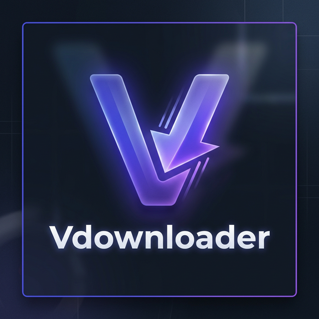

<p align="center">
  
</p>

<h1 align="center">Vdownloader</h1>

<p align="center">
  <strong>⚡ Professional Download Manager for VAXP-OS</strong><br/>
  <em>Lightning-fast HTTP & BitTorrent downloads with a stunning Glassmorphism UI</em>
</p>

<p align="center">
  
  
  
  
</p>

---

## 🚀 Overview

**Vdownloader** is a next-generation download manager built for VAXP-OS, designed to rival IDM and qBittorrent. It combines **multi-threaded HTTP/HTTPS/FTP downloads** with a full **BitTorrent engine**, wrapped in a beautiful **Glassmorphism UI** that integrates seamlessly with the VAXP ecosystem.

## ✨ Features

### 📥 HTTP/HTTPS/FTP Downloads
- **Multi-threaded download engine** powered by libcurl
- **Real-time speed calculation** with live progress tracking
- **Pause / Resume / Cancel** with seamless toggle controls
- **Auto-detect filename** from URL
- **Show in Folder** button on completion — opens file manager instantly
- **Download queue management** with configurable concurrency

### 🧲 BitTorrent
- **Full libtorrent-rasterbar 2.x** integration
- Add **.torrent files** via native file chooser
- Add **Magnet links** with metadata auto-fetch
- **DHT, LSD, UPnP, NAT-PMP** — fully decentralized discovery
- Live display: **peers, seeds, download/upload speed, ETA**
- **Pause / Resume / Remove** individual torrents

### 📊 Live Dashboard
- **Active & Completed counters** — updated in real-time
- **Download & Upload speed** — global rates
- **Speed graph** — Cairo-rendered real-time visualization with gradient fill

### ⚙️ Settings & Configuration
- **Download directory** selection
- **Max concurrent downloads** (1-16)
- **Segments per download** (1-32)
- **Speed limiting** (KB/s, 0 = unlimited)
- **Clipboard URL monitoring** toggle
- JSON-based config persistence

### 📋 Smart Features
- **Clipboard monitoring** — auto-detects download URLs
- **URL validation** — supports HTTP, HTTPS, FTP, Magnet
- **File categorization** — auto-categorize by extension
- **Notification system** via libnotify
- **SQLite database** for download history with WAL optimization

### 🎨 Design
- **Glassmorphism UI** — 60% transparent dark background
- **vaxpOS-style window controls** — colored close/minimize/maximize dots
- **Sidebar navigation** — Dashboard, Downloads, Torrents, Statistics, Settings
- **Smooth transitions** — crossfade view switching
- **Custom CSS theme** — premium dark mode with purple/indigo accents

---

## 📸 Screenshots

<p align="center">
  <em>Glassmorphism design with transparent dark background and custom header bar</em>
</p>

---

## 🔧 Dependencies

### Build Requirements

| Package | Version | Description |
|---------|---------|-------------|
| `meson` | ≥ 0.59 | Build system |
| `ninja` | — | Build backend |
| `gcc` | ≥ 13 | C compiler (C17) |
| `g++` | ≥ 13 | C++ compiler (C++17) |
| `pkg-config` | — | Dependency detection |

### Runtime Libraries

| Library | Package Name | Version | Purpose |
|---------|-------------|---------|---------|
| GTK4 | `libgtk-4-dev` | ≥ 4.6 | UI framework |
| Libadwaita | `libadwaita-1-dev` | ≥ 1.2 | Adaptive UI widgets |
| libcurl | `libcurl4-openssl-dev` | ≥ 7.68 | HTTP/HTTPS/FTP engine |
| SQLite3 | `libsqlite3-dev` | ≥ 3.31 | Download database |
| libnotify | `libnotify-dev` | ≥ 0.7 | Desktop notifications |
| JSON-GLib | `libjson-glib-dev` | — | Config persistence |
| OpenSSL | `libssl-dev` | ≥ 1.1 | TLS/SSL support |
| libtorrent | `libtorrent-rasterbar-dev` | ≥ 2.0 | BitTorrent engine |

### Install All Dependencies (Ubuntu/Debian)

```bash
sudo apt install -y \
  meson ninja-build gcc g++ pkg-config \
  libgtk-4-dev libadwaita-1-dev \
  libcurl4-openssl-dev libsqlite3-dev \
  libnotify-dev libjson-glib-dev libssl-dev \
  libtorrent-rasterbar-dev
```

### Install All Dependencies (Fedora)

```bash
sudo dnf install -y \
  meson ninja-build gcc gcc-c++ pkgconfig \
  gtk4-devel libadwaita-devel \
  libcurl-devel sqlite-devel \
  libnotify-devel json-glib-devel openssl-devel \
  libtorrent-rasterbar-devel
```

### Install All Dependencies (Arch Linux)

```bash
sudo pacman -S --noconfirm \
  meson ninja gcc pkgconf \
  gtk4 libadwaita \
  curl sqlite libnotify \
  json-glib openssl libtorrent-rasterbar
```

---

## 🛠️ Building

```bash
# Clone the repository
git clone https://github.com/VAXPAPPS/vdownloader.git
cd Vdownloader

# Configure build
meson setup builddir

# Compile
meson compile -C builddir

# Run
./builddir/vxap-downloader
```

### Install System-Wide

```bash
sudo meson install -C builddir
```

---

## 🏗️ Architecture

```
Vdownloader/
├── src/
│   ├── core/                    # Application core
│   │   ├── vdl-application.c    # App lifecycle (startup/shutdown)
│   │   ├── vdl-config.c         # JSON config manager
│   │   ├── vdl-logger.c         # File & console logging
│   │   ├── vdl-utils.c          # Formatting, URL parsing
│   │   ├── vdl-enums.h          # Shared enumerations
│   │   └── vdl-types.h          # Type definitions
│   │
│   ├── engine/
│   │   ├── http/
│   │   │   ├── vdl-http-engine.c    # libcurl download engine
│   │   │   ├── vdl-segment.c        # Download segments
│   │   │   ├── vdl-chunk-manager.c  # Chunk management
│   │   │   └── vdl-speed-limiter.c  # Bandwidth throttling
│   │   ├── torrent/
│   │   │   ├── vdl-torrent-engine.h   # C API header
│   │   │   └── vdl-torrent-engine.cpp # libtorrent wrapper
│   │   └── scheduler/
│   │       ├── vdl-queue-manager.c  # Download queue
│   │       └── vdl-scheduler.c      # Task scheduling
│   │
│   ├── domain/entities/
│   │   ├── vdl-download-item.c  # Download entity (GObject)
│   │   └── vdl-category.c       # Category entity
│   │
│   ├── data/
│   │   ├── repositories/
│   │   │   └── vdl-sqlite-repo.c    # SQLite with WAL
│   │   └── migrations/
│   │       └── vdl-db-migration.c   # Schema versioning
│   │
│   ├── presentation/
│   │   ├── windows/
│   │   │   └── vdl-main-window.c    # Main window + dashboard
│   │   ├── views/
│   │   │   ├── vdl-downloads-view.c # Downloads list
│   │   │   ├── vdl-torrents-view.c  # Torrents list
│   │   │   ├── vdl-statistics-view.c# Stats dashboard
│   │   │   └── vdl-categories-view.c# File categories
│   │   ├── widgets/
│   │   │   ├── vdl-download-row.c   # Download item widget
│   │   │   ├── vdl-sidebar.c        # Navigation sidebar
│   │   │   ├── vdl-headerbar.c      # Custom title bar
│   │   │   ├── vdl-progress-ring.c  # Circular progress
│   │   │   └── vdl-speed-graph.c    # Real-time graph
│   │   └── dialogs/
│   │       ├── vdl-add-download-dialog.c
│   │       └── vdl-preferences-dialog.c
│   │
│   └── services/
│       ├── vdl-clipboard-monitor.c
│       ├── vdl-notification-service.c
│       └── vdl-checksum-verifier.c
│
├── data/
│   ├── css/style.css            # Glassmorphism theme
│   └── org.vaxp.downloader.gresource.xml
│
└── meson.build                  # Build configuration
```

---

## 🎯 Design Principles

| Principle | Implementation |
|-----------|---------------|
| **Clean Architecture** | Separated layers: Core → Domain → Data → Engine → Presentation |
| **Thread Safety** | Downloads in pthreads, UI updates via `g_idle_add` |
| **Signal-driven** | GObject signals for progress, pause, cancel events |
| **C/C++ Bridge** | libtorrent C++ wrapped with `extern "C"` opaque handle API |
| **Config Persistence** | JSON-based settings with sensible defaults |
| **Database** | SQLite with WAL journal mode for concurrent access |

---

## 🤝 Part of the VAXP Ecosystem

Vdownloader is part of the [VAXP-OS](https://github.com/VAXPAPPS) application ecosystem, following the same Glassmorphism design language with:
- 60% transparent dark backgrounds
- vaxpOS-style colored window control dots
- Purple/indigo accent gradient (#6366f1 → #4f46e5)

---

## 📄 License

This project is licensed under the **GPL-3.0 License** — see the [LICENSE](LICENSE) file for details.

---

<p align="center">
  <strong>Built for VAXP-OS</strong><br/>
  <em>© 2026 VAXP Team</em>
</p>
